  

 

I build **autonomous agent systems that prove their own work.** Agents that verify what they output, refuse the action they cannot justify, and run under tests and CI like any other production code.

Seven years shipping software. The last stretch entirely on agents — design, orchestration, guardrails, evaluation, deployment.

 

---

 

## Work

<table>
<tr>
<td width="50%" valign="top">

### [Relic](https://github.com/rafeyy-sxk/relic-ai)
**An agent that refuses to guess.**

Point it at legacy Python and walk away. It writes a characterization suite for each file, then **sabotages the original code twelve times and demands the tests notice.** A suite that catches nothing is decoration — that file is left alone, and the reason is written down.

`330 tests` · `95% coverage` · `mypy strict`

</td>
<td width="50%" valign="top">

### [Multi-Agent Research](https://github.com/rafeyy-sxk/multi-agent-research)
**Answers that cannot be unsourced.**

Four agents plan, fetch, extract and verify. The verifier must quote the source verbatim, and that quote is **checked against the document mechanically** — a fabricated quote cannot pass, however confident the model sounds.

`71 tests` · `98% coverage` · `mypy strict`

</td>
</tr>
<tr>
<td width="50%" valign="top">

### [Fault Diagnosis Agent](https://github.com/rafeyy-sxk/xai-fault-diagnosis-agent)
**An agent on real industrial data.**

Isolation Forest anomaly detection over NASA CMAPSS turbofan sensors, with a LangGraph agent that explains *why* a reading is anomalous through SHAP attribution and estimates remaining useful life.

`45 tests` · `LangGraph` · `FastAPI`

</td>
<td width="50%" valign="top">

### [OpenDefectKit](https://github.com/rafeyy-sxk/opendefectkit)
**Computer vision inspection infrastructure.**

Industrial defect detection in Python — preprocessing, detection, benchmarking and ONNX export, built as a library rather than a notebook.

`Python` · `OpenCV` · `ONNX`

</td>
</tr>
</table>

 

---

 

## Stack

 

---

 

## Also built

**Multi-agent development harness** — the system my own work runs under. A coordinating session allocates work to named agents on their own git worktrees, a guard blocks destructive commands before they run, and read-only auditors adversarially review every diff before a pull request opens.
`70 agents` · `51 skills` · `33 rules` · `16 hooks` · `5 MCP servers`

**[PaceLab](https://pacelab-f1.vercel.app)** — live F1 race strategy platform, sole developer. FastAPI and DuckDB on Oracle Cloud, React 19 on Vercel, weekly automated refresh.
`61,332 laps` · `10,000-run Monte Carlo` · `XGBoost`

**Computer vision and document extraction** — real-time inspection APIs on FastAPI and Docker.
`94% precision` · `92% recall` · `91% OCR accuracy` · `−30% inference latency`

 

---

 

## Experience

**Freelance AI & Full-Stack Engineer** · 2019 → present

**Orion AI Solutions** · 2026 · production AI platform where agents call customers by voice and Stripe bills the account. Node, TypeScript, Prisma, PostgreSQL, Redis, BullMQ, React, Kubernetes. Shipped features, diagnosed live incidents, and built the verification process the team shipped under — a failing test first, a planted defect that must bite a named test, and an adversarial review of every diff.

**Independent clients** · 2019 → 2025 · backend services, APIs, data pipelines and web applications across Python and JavaScript.

 

**Certifications** — Supervised Machine Learning · Advanced Learning Algorithms · Unsupervised Learning, Recommenders, Reinforcement Learning
*DeepLearning.AI, licensed by Stanford University*

 

---

 

## How I build

> **A test that cannot fail is not a test.** Plant the defect, prove a named test bites, then restore.
>
> **Verify mechanically, not rhetorically.** If a model claims support, check the claim against the source in code.
>
> **Every number has a receipt.** Exit codes, row counts, timestamps — or it does not go in the README.
>
> **The map before the grind.** See the whole thing end to end, then build it once.

 

  

**Open to remote roles building agent systems**
`abdulrafeyy23@gmail.com`

